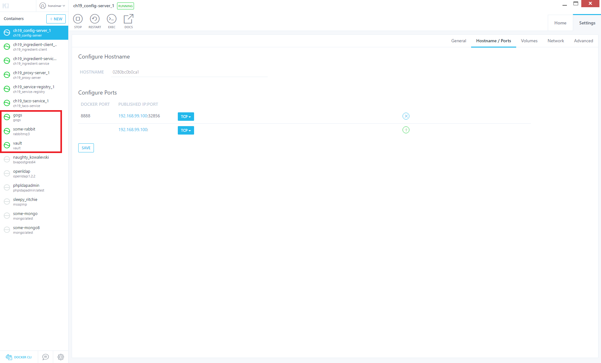

== GENERATE CERT

https://developer.okta.com/blog/2019/03/07/spring-microservices-https-oauth2

* Download mkcert binary for Windows:
  * mkcert-v1.3.0-windows-amd64.exe localhost 127.0.0.1 ::1 ingredient-service ingredient-client service-registry 192.168.99.100
* Download openssl binary for Windows:
  * openssl pkcs12 -export -in localhost.pem -inkey localhost-key.pem -out keystore.p12 -name bootifulsecurity

*Structure*

* ch19 - docker-compose example

= Spring in Action 5 Sample Code

This is the sample code for _Spring in Action, Fifth Edition_, by Craig Walls (https://www.manning.com/books/spring-in-action-fifth-edition).

There is one folder for each chapter in the book--except for chapters 11 and 12, which share a source folder--each containing most or all of the sample code for that chapter.

This source code is available for download from the book's page at https://manning-content.s3.amazonaws.com/download/e/82a9e29-0235-4c4c-8988-8760d3830cd9/sia5-examples.zip[Manning.com] as well as in GitHub at https://github.com/habuma/spring-in-action-5-samples.

== IMPORTANT: Lombok

To avoid having to write and maintain what is mostly boilerplate Java code, I've elected to use https://projectlombok.org/[Lombok] in all of these examples. When building from the command line, using Maven, you shouldn't encounter any problems, as Lombok is included as part of the build process. But you will very likely encounter issues if you import these projects into your IDE.

If, after importing the projects into your IDE, you see errors complaining about missing getters, setters, constructors, or `log` instance variables, it's because Lombok is not installed in your IDE. These bits of code will be generated by Lombok automatically, but your IDE doesn't know that and complains that they are missing.

To fix the errors, simply install Lombok. Lombok has support for most common (and arguably a few uncommon) IDEs, so no matter which IDE you use, you should be covered. See https://projectlombok.org/setup/overview for details on installing Lombok in your IDE.

*Info*

